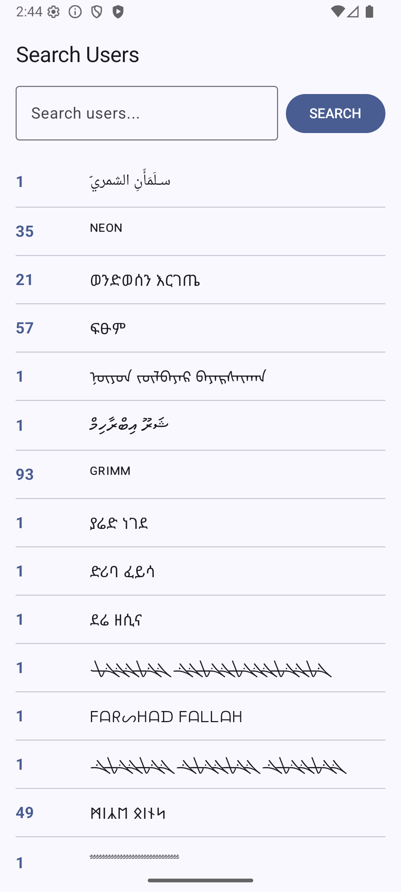
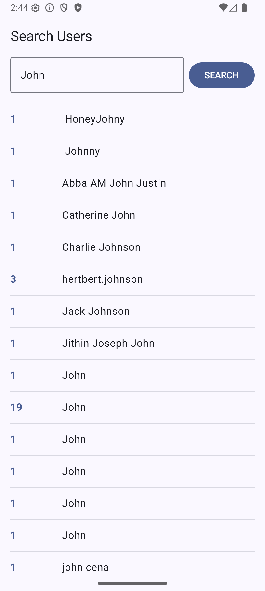
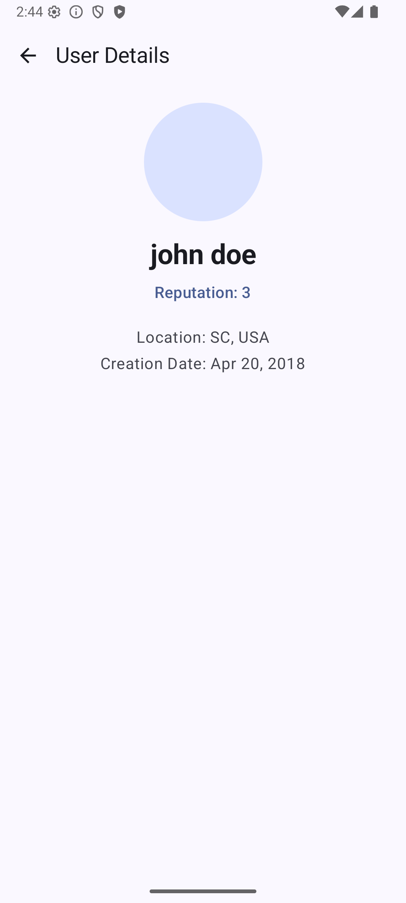

# Introduction

A simple Android project that showcases Clean Architecture with MVVM pattern using Jetpack Compose for UI and Hilt for dependency injection.

# Development

This project is made using Kotlin and Jetpack Compose as a test project. It showcases the use of Clean Architecture with MVVM pattern, featuring proper separation of concerns with data, domain, and UI (presentation) layers.

## Problem

Build an app that connects to the StackExchange API and displays users as described below.

### Main Screen

Display an input field and Button to search for users by name.  
Display up to 20 users alphabetically and show their reputation and username.  
When tapped, open a new screen to display more information about the user.

```
+--------------------+
| __________  SEARCH | - input and button  
| ------------------ |
| 123  Username1     |
| ------------------ |
| 390  Username2     | -----*tap* -----> user details screen
| ------------------ |
|   0  Username3     |
| ------------------ |
| 275  Username4     |
+--------------------+
```

### User Details Screen

Displays additional information about the user.

```
+--------------------+
|                    |
|   +-----------+    |
|   |           |    |
|   |   Avatar  |    |
|   |           |    |
|   +-----------+    |
|   User Name        |
|   Reputation       |
|                    |
|   Location         |
|   Creation Date    |
|                    |
+--------------------+
```

## Architecture

```
app/
├── data/
│   ├── api/                 # API interface & DTOs
│   └── repository/          # Repository implementation
├── di/                      # Dependency injection modules
├── domain/
│   ├── model/               # Domain models
│   └── usecase/             # Use cases (business logic)
└── ui/
    ├── search/              # Search screen (ViewModel, Screen, UiState)
    ├── details/             # User details screen (ViewModel, Screen, UiState)
    └── theme/               # Material 3 theming
```

## Packages Used

```
# UI
Jetpack Compose (Material 3)
Compose Navigation

# Networking
Retrofit 2.9.0
OkHttp 4.12.0
Moshi 1.15.0

# Dependency Injection
Hilt 2.51
Hilt Navigation Compose 1.2.0

# Code Generation
KSP (Kotlin Symbol Processing)

# Testing
JUnit 4
MockK 1.13.10
Kotlinx Coroutines Test 1.8.1
```

## Requirements and Constraints

* The project must compile by executing gradle with `lint test assembleDebug`

## Build

```bash
./gradlew lint test assembleDebug
```

## References

- [StackExchange API](https://api.stackexchange.com/docs)

# Functional Screenshots

  
